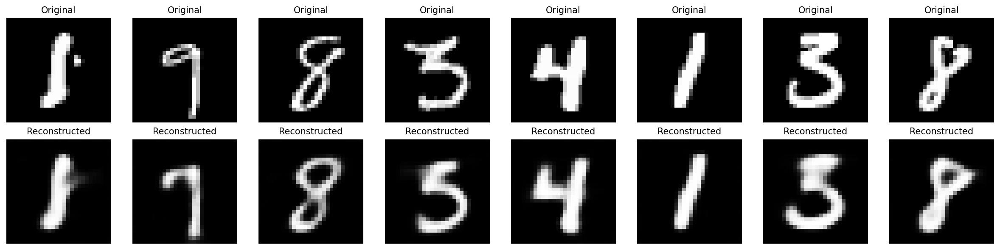
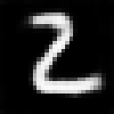

# Mini VAE Interpolation

A PyTorch implementation of a **Variational Autoencoder (VAE)** trained on **MNIST** digits, with smooth interpolation capabilities in the latent space.

---

## 🧠 Model Architecture

- **Encoder**: 3 convolutional layers  *(Channels: 32 → 64 → 128, with BatchNorm)*
- **Latent Space**: 20-dimensional with **reparameterization trick**
- **Decoder**: 3 transposed convolutional layers to reconstruct 28×28 images
- **Loss Function**: `Binary Cross-Entropy + KL Divergence (β-VAE variant)`

---

---

## 📊 Results

### 🔁 Reconstructions  
**Original digits (top row)** vs **VAE reconstructions (bottom row)**:

---

### 🔄 Interpolations  
Smooth transitions between different digits:

- **0 to 1 Interpolation**  
  

- **2 to 7 Interpolation**  
  
